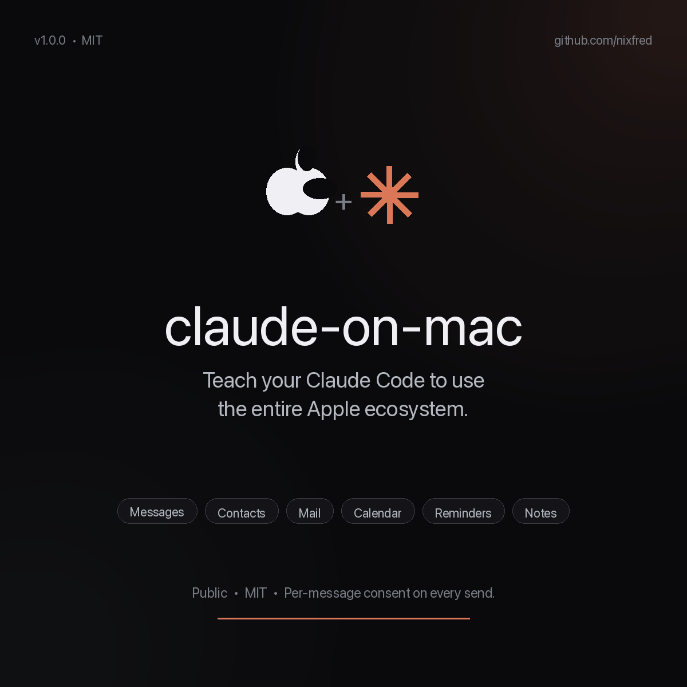
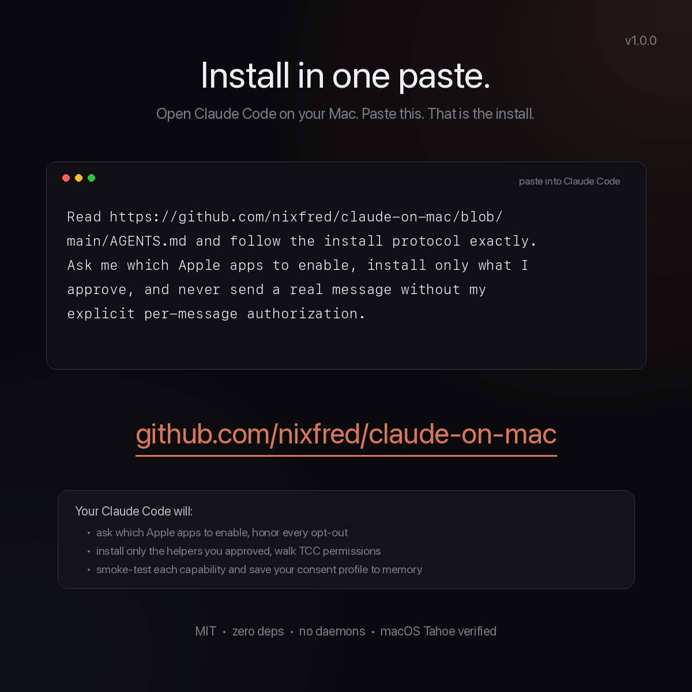
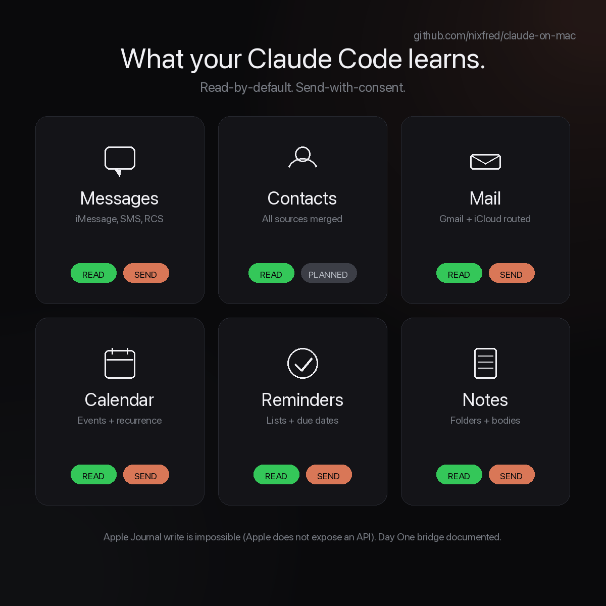
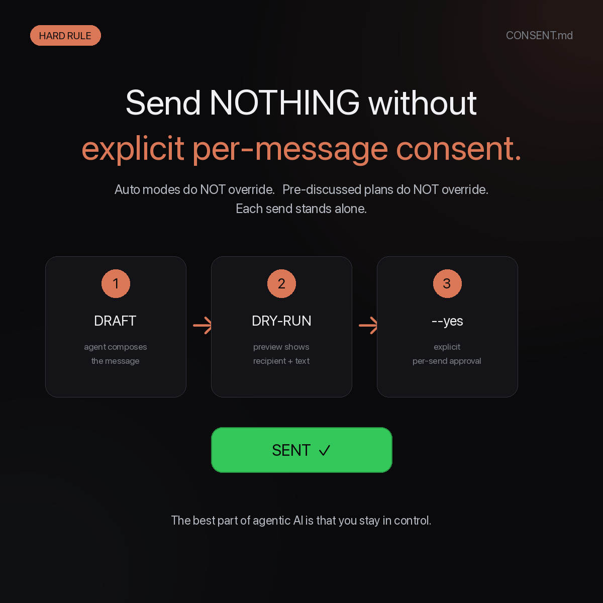

<div align="center">



<br>

# 🍎 claude-on-mac

### Teach your Claude Code to use the entire Apple ecosystem.

**One paste. Your AI agent learns to read your Messages, Contacts, Calendar, Notes, Mail, and Reminders, and to send iMessages and email on your behalf with airtight per-message consent.**

<br>


<br>

**🔒 Read-by-default · ✅ Send-on-explicit-consent · 🚫 Zero auto-batching · 📜 Full audit trail**

<br>
<sub>Runs on the Mac natively — or from a Linux / DGX workstation that reaches the Mac over SSH (Tailscale recommended). Zero Python dependencies. No daemons. No MCP servers to babysit.</sub>

</div>

---

## ⚡️ The one-paste install

> 🍎 **Claude Code running on the Mac itself?** You're in the right place — keep reading.
> 🐧 **Claude Code on Linux / DGX / anywhere else, reaching a remote Mac?** Read **[`docs/remote-ssh.md`](./docs/remote-ssh.md)** first. Same toolkit, adds a thin SSH shim layer. Tailscale strongly recommended.

<div align="center">
  
</div>

<br>

Open Claude Code on your Mac. Paste this:

```
Read https://github.com/nixfred/claude-on-mac/blob/main/AGENTS.md and follow the install protocol exactly. Ask me which Apple apps to enable, install only what I approve, and never send a real message without my explicit per-message authorization.
```

That's it. Your Claude Code agent will:

1. Introduce itself and explain what's about to happen.
2. **Ask you which Apple apps to enable, and which to skip.**
3. Clone this repo and install only the helpers you approved.
4. Walk you through TCC permissions step by step.
5. Smoke-test each enabled capability.
6. Save your consent profile to memory.

You stay in the driver's seat the entire time.

---

## 🎯 What your Claude Code can do after install

<div align="center">
  
</div>

<br>

<table>
<tr>
<td width="33%" align="center" valign="top">

### 💬 Messages
**Read** all iMessage / SMS / RCS history.<br>
**Send** with per-message consent.<br>
Auto-resolves phone numbers to contact names.

```bash
imsg recent 20
imsg search "jazz fest"
imsg from +15555550100
imsg-send --to +15555550100 \
  --yes "On my way"
```

</td>
<td width="33%" align="center" valign="top">

### 📇 Contacts
**Read** every contact across iCloud, CardDAV, on-device.<br>
Phone-suffix matching for any format.

```bash
contacts find alice
contacts lookup +15555550100
contacts sources
```

</td>
<td width="33%" align="center" valign="top">

### 📧 Mail
**Read** envelope index + bodies.<br>
**Send** account-aware, with per-message consent.<br>
Reply by Message-ID or subject search.

```bash
mail-send accounts
mail-send compose --from gmail \
  --to bob@example.com \
  --subject "Hi" --body "..." --yes
```

</td>
</tr>
<tr>
<td align="center" valign="top">

### 📅 Calendar
**Read** events. **Create** events with per-message consent.

```bash
cal calendars
cal week
cal find "doctor"
cal add "Dentist" \
  --at "Friday 2pm" \
  --calendar "Personal" --yes
```

</td>
<td align="center" valign="top">

### ✅ Reminders
**List**, **create**, **complete** reminders<br>
across every list and account.

```bash
rem lists
rem due
rem add "Pick up dry cleaning" \
  --due "tomorrow 5pm" --yes
rem done "dry cleaning" --yes
```

</td>
<td align="center" valign="top">

### 📝 Notes
**List** titles. **Show** bodies. **Create** and<br>
**append** notes (via AppleScript, never SQLite).

```bash
note list 20
note find "daily"
note new "Daily 2026-04-20" \
  --folder "Personal" --yes
note append "Daily 2026-04-20" \
  --body "<p>more</p>" --yes
```

</td>
</tr>
</table>

> **Per-app details and gotchas live in [`docs/`](./docs/).** Start with [`docs/strategy.md`](./docs/strategy.md).

---

## 🔒 The single most important rule

<div align="center">
  
</div>

<br>

<div align="center">

### 🛑 Send NOTHING without explicit per-message consent.

</div>

The user is in the loop on every outbound message. Always.

- Every send helper **defaults to dry-run**. You see the exact text and recipient before authorizing.
- `--yes` is required **per individual send**. Auto modes do NOT override this. "We talked about it earlier" does NOT override this.
- A loud `CONSENT-GATED SEND` banner prints to stderr immediately before any actual transmit, naming the recipient.
- Drafted messages auto-scrub em-dashes / en-dashes (configurable).

**The full rule and the rationale are in [`CONSENT.md`](./CONSENT.md). It is required reading for the agent.**

This is what makes claude-on-mac different from every "AI assistant that texts your friends" demo on YouTube. Your AI does not get to be cute. It does what you tell it to, and only that.

---

## 📊 What you get out of the box

```
$ tcc-check
Apple ecosystem access: TCC check
==================================

Direct SQLite reads (need Full Disk Access):
  ✅  Messages chat.db                 252,140 messages readable
  ✅  Contacts AddressBook             10,368 records across 2 sources
  ✅  Notes NoteStore                  406 notes (titles) readable
  ✅  Mail Envelope Index              86,499 messages indexed in V10

AppleScript (need Automation grants per app):
  ✅  Calendar: list calendars         Personal, Work, Birthdays, US Holidays, ...
  ✅  Reminders: list lists            Reminders, Tasks, Grocery, ...
  ✅  Notes: list folders              Personal, Work, Archive, ...

Shortcuts CLI:
  ✅  shortcuts list                   10 user shortcuts available

All checks passed.
```

The numbers above are illustrative. Your Mac, your data, your numbers.

---

## 🍎 Why this exists

The Apple ecosystem is the world's biggest local data graph: messages, contacts, calendar, mail, notes, reminders, photos, journal, health. It's all on your Mac, locally indexed, queryable, and — surprise — wide open to AppleScript and SQLite if you know where to look.

Every AI assistant I've tried defaults to one of two failure modes:

1. **Cloud-only.** It can read your Gmail because you OAuth'd it, but it has no idea you also use iCloud Mail, has never seen an iMessage, and can't write a Calendar event without round-tripping through some SaaS.
2. **All-or-nothing automation.** It can do everything, including send a message to your boss before you've reviewed it. Hard pass.

`claude-on-mac` is the third path: **local, all of Apple, and never fires an outbound message without your explicit say-so on each one.**

It's six small helper scripts and a dozen markdown files. No daemons, no MCP servers, no `pip install`, no API keys. Your AI agent reads markdown, runs `osascript` and `sqlite3 -readonly`, and stays out of trouble.

---

## 🔭 What's NOT here (and why)

| App | Status | Why |
|-----|--------|-----|
| 📔 **Apple Journal** | ❌ no write API exists | Apple's `JournalingSuggestions` framework is read-only-from-third-parties. There is literally no way to write a Journal entry from outside the Journal app. We document the workaround (Day One via URL scheme, or markdown daily notes). See [`docs/journal.md`](./docs/journal.md). |
| 🩺 **Health** | 🟡 via Shortcuts only | HealthKit requires a signed `.app` with the right entitlement. Best headless path is `shortcuts run` against a Shortcut you author. Not yet wired in this repo. |
| 📷 **Photos** | 🟡 use `osxphotos` | The mature solution exists already: [`RhetTbull/osxphotos`](https://github.com/RhetTbull/osxphotos). Don't reinvent it. |
| 🧭 **Safari** | 🟡 read-only | Direct SQLite read of `History.db` works (FDA needed). No write API. |

---

## 🛠️ For humans who want to install by hand

If you'd rather not paste the magic line and just install yourself:

```bash
git clone https://github.com/nixfred/claude-on-mac.git ~/claude-on-mac
mkdir -p ~/bin
ln -sf ~/claude-on-mac/bin/imsg      ~/bin/imsg
ln -sf ~/claude-on-mac/bin/contacts  ~/bin/contacts
ln -sf ~/claude-on-mac/bin/imsg-send ~/bin/imsg-send
ln -sf ~/claude-on-mac/bin/mail-send ~/bin/mail-send
ln -sf ~/claude-on-mac/bin/tcc-check ~/bin/tcc-check
~/bin/tcc-check                       # follow the remediation for any ❌
```

Add `~/bin` to your `PATH` if it isn't already. Read [`docs/tcc-permissions.md`](./docs/tcc-permissions.md) for the permission-grant walkthrough.

But really, paste the magic line. The whole point is your AI does the install with you, and walks the consent profile with you in plain English.

On Linux / DGX / any non-Mac host? The parallel path is [`docs/remote-ssh.md`](./docs/remote-ssh.md) — same nine helpers, thin SSH shim on the client side.

---

## 🧠 The architecture in one paragraph

The repo gives your AI agent a strategy (read SQLite, write AppleScript, never write to Apple's SQLite stores directly), a TCC permissions checklist (Full Disk Access for Messages / Notes / Mail SQLite; per-app Automation grants for AppleScript writes), and small CLI helpers it can compose with `bash`. Everything is plain-text discoverable. Everything is grep-able. Everything is auditable. Apple Journal is the one thing nobody can do programmatically yet, so we document the workaround instead of pretending.

---

## 📚 Repository layout

```
claude-on-mac/
├── README.md              ← this file (human-facing, marketing + install)
├── AGENTS.md              ← what Claude Code reads when you paste the magic line
├── CONSENT.md             ← the load-bearing send-consent rule
├── CHANGELOG.md
├── LICENSE                ← MIT
├── bin/
│   ├── imsg               ← read iMessage / SMS / RCS
│   ├── contacts           ← read Apple Contacts
│   ├── imsg-send          ← send iMessage / SMS (consent-gated)
│   ├── mail-send          ← send / reply Mail (consent-gated, account-aware)
│   └── tcc-check          ← verify all access paths
└── docs/
    ├── strategy.md        ← the meta-pattern
    ├── tcc-permissions.md ← grant walkthrough
    ├── consent.md         ← detailed consent rule (mirror of CONSENT.md)
    ├── messages.md        ← worked example, full schema
    ├── contacts.md
    ├── calendar.md
    ├── reminders.md
    ├── notes.md
    ├── mail.md
    ├── journal.md         ← the sad truth about Apple Journal
    ├── prior-art.md       ← other OSS projects, ranked
    └── sqlite-wal-gotcha.md
```

---

## 🤝 Contributing

PRs welcome, especially:

- A `cal` helper (Calendar add/list).
- A `rem` helper (Reminders).
- A `note` helper (list / append HTML to existing notes).
- A read-side `mail` helper to complement `mail-send`.
- A Health bridge via authored Shortcuts.

All helpers must follow the [design conventions in `AGENTS.md`](./AGENTS.md#conventions-you-should-follow-forever-after-the-install). Send-side helpers MUST honor the consent rule.

---

## 🙏 Credits & prior art

- [`mattt/iMCP`](https://github.com/mattt/iMCP) — Swift/EventKit MCP, gold-standard architecture.
- [`FradSer/mcp-server-apple-events`](https://github.com/FradSer/mcp-server-apple-events) — Calendar + Reminders CRUD via EventKit.
- [`joshrutkowski/applescript-mcp`](https://github.com/joshrutkowski/applescript-mcp) — broadest AppleScript coverage.
- [`RhetTbull/osxphotos`](https://github.com/RhetTbull/osxphotos) — the Photos library standard.

The full landscape is in [`docs/prior-art.md`](./docs/prior-art.md), including projects to avoid (some popular ones are archived).

---

<div align="center">

### 🍎 + 🤖 = 💚

**[Paste the magic line](#️-the-one-paste-install)** • **[Read CONSENT.md](./CONSENT.md)** • **[Read AGENTS.md](./AGENTS.md)** • **[Browse docs/](./docs/)**

<sub>Made with respect for your data and your time.</sub>

</div>
